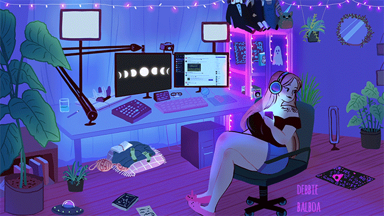

# Podcast: Elas na Tech & IA 🎙️

## 📒 Descrição
Este projeto apresenta um episódio de podcast fictício criado inteiramente por IAs Generativas. O objetivo foi explorar a capacidade das ferramentas atuais de criar diálogos fluidos, vozes naturais e conteúdo visual alinhado, debatendo o papel da mulher na revolução da Inteligência Artificial.

## 🤖 Tecnologias Utilizadas
* **ChatGPT (OpenAI):** Para roteirização do diálogo e estruturação do conteúdo.
* **ElevenLabs:** Para clonagem de voz e síntese de fala (Text-to-Speech) com entonação realista.
* **Bing Image Creator (DALL-E 3):** Para geração da arte de capa do episódio.
* **Git & GitHub:** Para versionamento e portfólio.

## 🧐 Processo de Criação
1.  **Roteiro:** Utilizei o ChatGPT com um prompt focado em "diálogo natural, com gírias leves e pausas para respiração", simulando uma entrevista entre uma estudante de computação e uma especialista em IA.
2.  **Áudio:** O texto foi submetido ao ElevenLabs, onde escolhi duas vozes distintas ('Rachel' e 'Antoni') e ajustei a estabilidade para garantir emoção na fala.
3.  **Edição:** (Opcional) Uni os áudios usando uma ferramenta básica.
4.  **Visual:** Pedi ao Bing Image Creator uma imagem estilo "Cyberpunk Lo-fi" representando mulheres programando com hologramas.

## 🚀 Resultados

O resultado é um áudio de 2 minutos que discute a importância da diversidade no treinamento de modelos de IA.

👉 [Clique aqui para ouvir o Podcast (MP3)](assets/podcast_episodio1.mp3)

## 💭 Reflexão
O desafio de criar algo 'Natty' (natural) está na entonação. Enquanto o texto é fácil de gerar, a ironia, o riso e as pausas naturais da fala humana ainda exigem ajustes manuais finos nas ferramentas de áudio. A fronteira entre o real e o sintético está cada vez mais tênue.